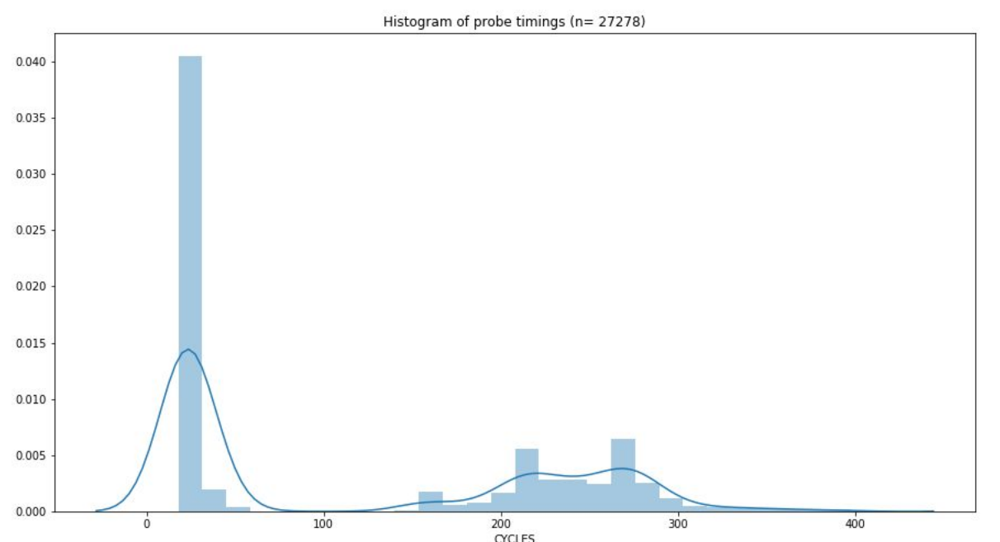

# covert 

Covert channel exploit using L3 cache (LLC).  This program sends a text message between processes without direct communication using flush+reload timings on the LLC.  By using the L3 cache, the processes can be executed on separate cores of the same CPU.  

## background research 
To gain background knowledge on covert channels, I started off by reading “FLUSH+RELOAD: A High Resolution, Low Noise, L3 Cache Side-Channel Attack” by Yuval Yarom et al. Further googling led me to the research publications of Clementine Maurice et al. Her publications were the most helpful in concretizing what I needed to do to implement a cache covert channel. Most other papers did not get into the implementation and stuck with theory. In particular, Maurice’s papers entitled “Hello from the Other Side: SSH over Robust Cache Cover Channels in the Cloud” and “C5: Cross-Cores Cache Covert Channel”. These papers led me into the direction of exploiting the last-level cache (LLC). In order to establish a covert channel across cores, one should utilize the LLC. In the case of my own test machine, this is the L3 cache. The LLC is shared and inclusive.  That means that data in the L1 cache also exists in the LLC, and data evicted from the LLC is also evicted from the L1 cache.  

The strategy is as follows:
(1) The sender will flush 0th set of the L3 cache if it wants to send a 1. Otherwise, it will do nothing to send a 0. The flushing or waiting will last for one period length.
(2) The receiver will probe the 0th set of its own L1 cache to listen. The receiver will continuously probe for one period length. On majority cache hits, it will assume a 0 is being sent. On majority cache misses, it
will assume a 1 is being set.
(3) The sender will send a special initiate sequence to denote the start of a message (10011011). The end of the message will be eight 0 bits (00000000).

To account for noise, the sending and listening lasts for the duration of one period length. This length is defaultly set to 500 microseconds, but it can be adjusted as an input argument. Thus, for the period length, the sender will constantly flush/wait and the receiver will constantly probe. The receiver will collect a list of probe timings over the period. The fraction of total probes that exceed a decision boundary (default set to 150 microseconds) is calculated. If this fraction is less than 0.5, then a 1 bit is heard. Otherwise, a 0 bit is heard.

## Syncing sender and receiver 

A big challenge was to sync up my processes. That is, the sender and receiver
need to be flushing/waiting and probing respectively around the same time. Their period durations need to be relatively synced.

My solution to this was to apply a correction factor to the receiver’s operation whenever it is “seeking” the receiver's message. The correction is split up into two activities.
+ The first activity is delaying the receiver in an attempt to sync with the sender. If the fraction of cache misses during the duration is greater than some threshold of the total accesses ( << 0.5), then a time correction is applied to the receiver. It waits for an amount of time proportional to the fraction of cache misses. This fraction is expected to sharply decline as 1’s start to be sent by the receiver. The limit of this time correction is 0 given that the fraction decreases for every 1 bit that is sent by the sender. The
base assumption here is that there exists minimal noise and any cache misses are caused by the sender’s flushing.
+ The second activity is relaxing the threshold for hearing a 1. If the fraction of cache hits during the duration is less than some relaxed threshold ( >> 0.5), then a 1 is heard. Once the initiate sequence is heard, the threshold changes to 0.5.

## Tweaking parameters for threshold 

The threshold timing for recording 0 or 1 bits was experimentally determined.  This experimental process should be repeated if the covert channel is to be run on a different architecture.  

The plot below shows the timings of probing the LLC layer when flushed and not flushed.  From it, we can determine what a reasonable threshold could be.  

